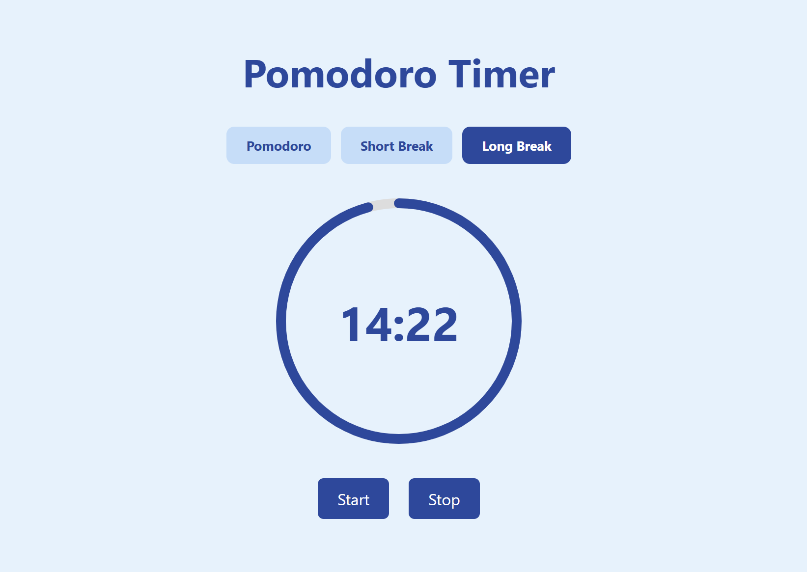

# Pomodoro-Timer
A modern Pomodoro Timer built with HTML, CSS, and JavaScript.

# Features
- Sound alerts when timer starts/stops  
- Animated circular progress bar  
- Desktop notifications when time is up  
- Responsive design  
- Clean and simple UI  

# Technologies Used
- HTML5  
- CSS3  
- JavaScript

# The Process
I made this Pomodoro Timer to practice and improve my front-end JavaScript skills.
First, I created the layout using basic HTML and CSS. Then, I used JavaScript to make the timer work using setInterval().To make it more engaging, I added an animated progress circle using SVG that moves as time counts down. I also added sound alerts when the timer starts or ends, and desktop notifications for better interactivity. It’s fully responsive and simple to use.  

# Preview

